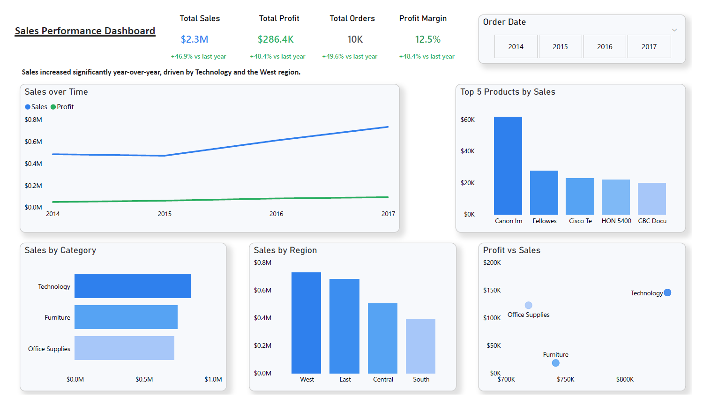

# Sales Performance Dashboard (Power BI)

## Overview
This project showcases a Power BI dashboard focused on analyzing sales performance, including trends, profitability, and regional insights.

## Dashboard Preview

## Objectives
- Analyze revenue trends over time
- Evaluate profitability and profit margin
- Identify top-performing categories and regions
- Compare year-over-year growth

## Process

1. Data Cleaning
- Converted data types (dates, sales, profit)
- Removed inconsistencies and ensured data quality

2. Data Modeling
- Worked with a single table (Orders)
- Created calculated measures using DAX (e.g., Profit Margin, YoY)

3. Visualization
- Designed KPIs to summarize performance
- Used line charts for trends
- Used bar charts for category and regional comparison
- Used scatter plot to analyze relationship between sales and profit

4. Insights
- Identified growth trends over time
- Highlighted top-performing categories and regions

## Business Value
This dashboard helps stakeholders:
- Monitor sales performance
- Identify high-performing categories and regions
- Understand profitability trends
- Support data-driven decision-making

## Tools
- Power BI
- DAX

## Future Improvements
- Add more advanced data modeling
- Include customer segmentation
- Improve dashboard design and interactivity
